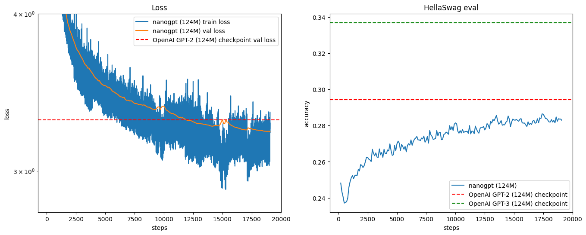
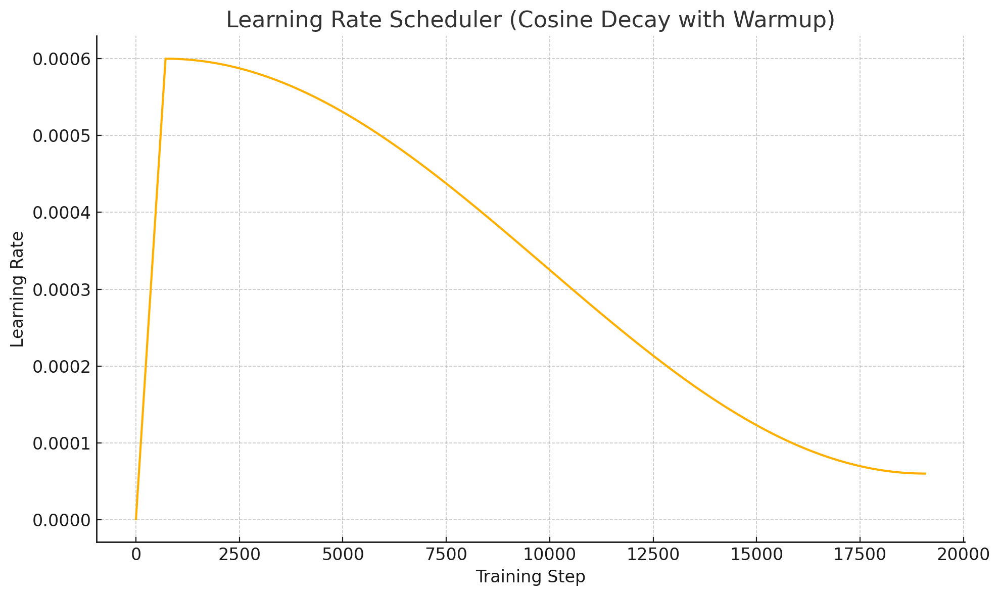

# GPT-2 (124M) Trained from Scratch on FineWeb-Edu with HellaSwag Evaluation

## 📌 Project Overview

This repository contains a from-scratch PyTorch implementation of a GPT-2 (124M) language model trained entirely on the `FineWeb-Edu` dataset (10B tokens). The model is evaluated using:

- **Language modeling loss** (on training and validation sets)
- **Zero-shot HellaSwag accuracy**, a commonsense reasoning benchmark

---

## 🚀 Highlights

- Achieved **val loss: 3.22**, better than OpenAI's original GPT-2 val loss (\~3.3)
- Achieved **0-shot HellaSwag accuracy: 28.3%** (GPT-2 baseline: 29.5%)
- Fully trained on `FineWeb-Edu` 10B-token dataset from scratch using PyTorch

---

## 🧠 Model Architecture

| Component     | Value       |
| ------------- | ----------- |
| Model Size    | 124M params |
| Layers        | 12          |
| Heads         | 12          |
| Embedding Dim | 768         |
| Block Size    | 1024 tokens |

---

## 🗂️ Dataset

- **Training**: `edu_fineweb10B` pre-tokenized `.npy` shards (10B tokens)
- **Validation**: held-out validation shards + `HellaSwag` benchmark

---

## 📊 Results

### Loss

- **Final Training Loss**: \~3.21
- **Final Validation Loss**: **3.22**

### HellaSwag Accuracy

- **Zero-shot Accuracy**: **28.3%**
- **GPT-2 Baseline**: 29.5%
- **GPT-3 Baseline**: 33.9%

<p align="center">
  
</p>

> Note: This result was obtained **without any prompt engineering or instruction tuning** (pure 0-shot evaluation).

---

## 🏗️ Training Setup

- **Batch size**: 524,288 tokens (with gradient accumulation)
- **Sequence length**: 1024
- **Optimizer**: AdamW (fused)
- **Precision**: bfloat16 (with `torch.autocast`)
- **Scheduler**: Cosine decay with warmup
- **Hardware**: NVIDIA L40S GPU (1x, 48GB)
- **Total Training Time**: \~27 hours
- **Average Token/sec**: \~106,000
- **Average Step Time**: \~4.9s

> Additional optimizations:
>
> - Fused AdamW optimizer for efficiency
> - Autocast + bfloat16 to lower memory usage
> - Manual gradient accumulation for large batch simulation

<p align="center">
  
</p>

---

## 🧪 Evaluation

Evaluation is done using:

- **Cross-entropy loss** on val set
- **HellaSwag benchmark** via next-token likelihood matching on 4 options

---

## 🧾 Usage

```bash
# Clone repo
$ git clone https://github.com/rsaketh002/gpt2-fineweb-edu.git

# Install dependencies
$ pip install torch tiktoken numpy datasets transformers

# Download the dataset
$ python fineweb.py

# Start training the model
$ python train.py

```

> Ensure `edu_fineweb10B` and HellaSwag data are preprocessed as `.npy`

---

## 📦 Model Upload

The model was trained from scratch and is compatible for export to Hugging Face Transformers as a GPT-2 style model. Tokenizer used: `tiktoken` GPT-2 tokenizer.

---

## 📚 Acknowledgements

- [Andrej Karpathy's nanoGPT](https://github.com/karpathy/nanoGPT)
- [HellaSwag benchmark](https://rowanzellers.com/hellaswag/)
- [FineWeb-Edu Dataset](https://huggingface.co/datasets/fineweb)

---

## 🧑‍💻 Author

**Saketh Reddy** | [LinkedIn](https://www.linkedin.com/in/gandeed-saketh-reddy-a1077a200/) | [GitHub](https://github.com/rsaketh002)
- [Model Weights]([https://huggingface.co/datasets/fineweb](https://huggingface.co/saketh3628800/custom-gpt-124M/blob/main/pytorch_model.bin))
---

## 📜 License

MIT License
